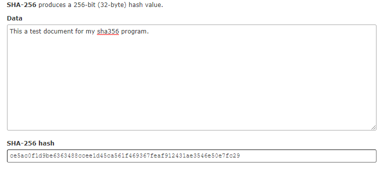

# Theory of Algorithms Assignment
An implementation of the SHA256 Hashing Algorithm in C

# The SHA256 Hashing Algorithm? 
SHA-2 (Secure Hash Algorithm 2) is a set of cryptographic hash functions designed by the NSA.

The standard for the algorithm can be found at https://nvlpubs.nist.gov/nistpubs/FIPS/NIST.FIPS.180-4.pdf

# How to Run
To run the script you need to have a c compiler installed.I used one for windows found at www.mingw.org

Follow these steps to then run the script.

1. Clone this repo using 'git clone https://github.com/aaronandyhealy/TheoryOfAlg'
2. Go into the cloned dircetory and run the following commands:
3. Compile - 'gcc sha256.c' and 'gcc padding.c'
4. Execute - 'sha256.exe'
5. Enter a file when asked

# Implementation
This project was completed using the guidance of video lectures created by our lecturer Dr Ian McLoughlin.

Research was completed alongside these videos to learn more about the SHA256 algorithm and its standards.

# Problems
While the sha256 hashing seemed to work at first, after testing it out against two online sha256 hashing converters. Below is an example of when I ran my program on a file compared to the two online converters on the same file.

_______________________________________________________________________________________________________________

_______________________________________________________________________________________________________________

As you can see the online tests are the same, therefore it is clear my program is not getting the correct hash value.

# Videos & Research
* [Video - Part 1](https://web.microsoftstream.com/video/db7c03be-5902-4575-9629-34d176ff1366)
* [Video - Part 2](https://web.microsoftstream.com/video/2a86a2ac-aafb-46e0-a278-a3faa1d13cbf)
* [Video - Part 3](https://web.microsoftstream.com/video/78dc0c8d-a017-48c8-99da-0714866f35cb)
* [Video - Part 4](https://web.microsoftstream.com/video/9daaf80b-9c4c-4fdc-9ef6-159e0e4ccc13)
* [Video - Part 5](https://web.microsoftstream.com/video/200e71ec-1dc1-47a4-9de8-6f58781e3f38) 
* [Video - Part 6](https://web.microsoftstream.com/video/f823809a-d8df-4e12-b243-e1f8ed76b93f)
* [What is SHA256?](https://www.hashgains.com/wiki/s/what-is-sha-256)
* [The Difference Between SHA-1,2 and 256](https://www.thesslstore.com/blog/difference-sha-1-sha-2-sha-256-hash-algorithms)
* [SHA256 and Bitcoin](https://www.mycryptopedia.com/sha-256-related-bitcoin)
